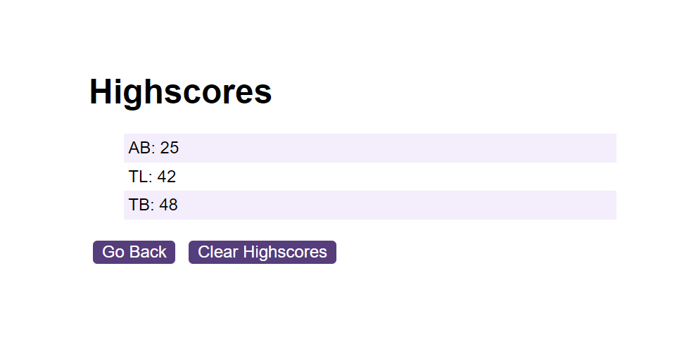

# Module 6 Challenge Web APIs: Code Quiz

## Description

An interactive coding quiz!! How much do you know about coding? Find out by taking this 10 question quiz. Be quick, as soon as you start a 60 second timer will begin. For each wrong answer you click, 10 seconds will be deducted! The time remaining when the quiz is over will be your final score! L

## URL

https://ablam87.github.io/Coding-Quiz/

## Installation

N/A

## Usage

Clicking the start button will begin the quiz and set the 60s timer going

Log your initials after the quiz is over. Your submission will be validated and your intitials & score saved to local storage.

View the full list of highscores in your session, and if you need to clear them, you can with the touch of the 'clear' button.

## License

MIT